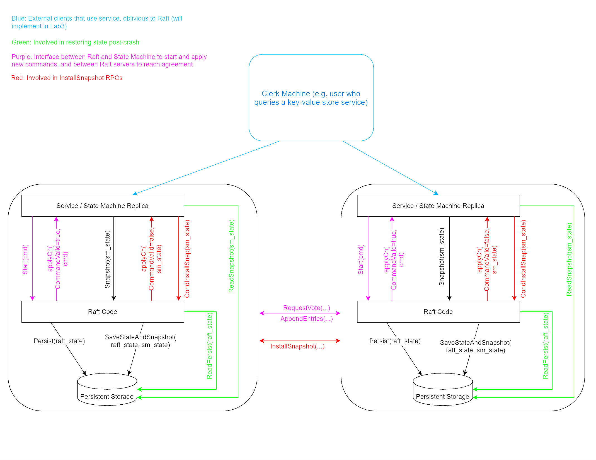
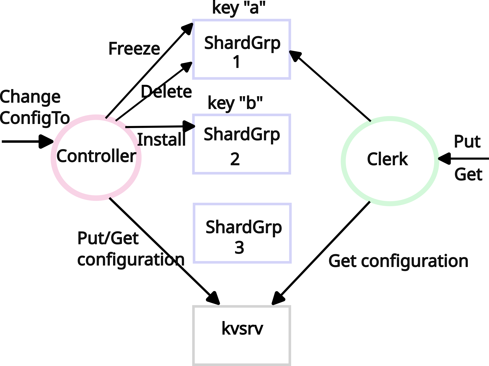

# zDB: A High-Performance, Raft-Based, Sharded Key-Value Store in C++ (Z for Zoza!)

[](https://github.com/as-family/zdb/actions/workflows/cmake-single-platform.yml)
[](https://www.gnu.org/licenses/agpl-3.0)
[](https://en.cppreference.com/w/cpp/23)

## Overview

zDB is a distributed, fault-tolerant key-value store implemented in modern C++23, based on the architecture described in the MIT 6.824 Distributed Systems course. It implements sharded replication using the Raft consensus protocol to provide strong consistency and fault tolerance. The implementation successfully passes the rigorous test suite provided by the course while extending the functionality with modern C++ features and performance optimizations.

### Current Status

The core Raft consensus module (MIT 6.824 Lab 3) is fully implemented and consistently passing the complete test suite. This includes leader election, log replication, persistence.

## System Architecture


## Key Features

- **Fault-Tolerant Consensus**
  - Full implementation of the Raft protocol
  - Leader election with heartbeat mechanism
  - Log replication with consistency checks
  - Persistent state and log storage

- **High Availability**
  - Automatic leader election on failures
  - Seamless failover between replicas
  - Log compaction via snapshotting

- **Strong Consistency**
  - Linearizable Get/Set/Erase operations
  - Atomic multi-key operations within shards
  - Consistent reads across replicas

## Quick Start

### Prerequisites
- Modern C++ compiler with C++23 support
- CMake 3.31 or higher

### Building from Source

1. Clone the repository:
   ```bash
   git clone https://github.com/as-family/zdb.git
   cd zdb
   ```

2. Set up vcpkg dependencies:
   ```bash
   ./setup-vcpkg.sh
   ```

3. Build the project:
   ```bash
   cmake --preset sys-gcc
   cmake --build --preset sys-gcc
   ```

4. Run tests:
   ```bash
   ctest --preset sys-gcc
   ```

## Documentation

- [Architecture & Design Document](docs/DESIGN.md) - Detailed discussion of technical decisions and implementation details
- [Raft Protocol Details](https://raft.github.io/) - Extended Raft consensus algorithm documentation

## Roadmap


- [ ] **Sharding & Scalability**
  - [ ] Dynamic shard allocation and rebalancing
  - [ ] Automatic shard migration
  - [ ] Linear scaling with number of shards
  - [ ] Load-balanced key distribution

- [ ] Multi-key ACID transactions across shards
- [ ] Read-only Ops via leader leases for improved read scalability
- [ ] Pluggable storage engines
- [ ] Metrics and monitoring integration
- [ ] Client libraries in multiple languages
- [ ] Dynamic membership changes

## Lab Progress
Following [MIT 6.5840 - Spring 2025](https://pdos.csail.mit.edu/6.824/schedule.html) labs
- [x] Lab 2
  - [x] Key/value server with reliable network
  - [x] Implementing a lock using key/value clerk
  - [x] Key/value server with dropped messages
  - [x] Implementing a lock using key/value clerk and unreliable network
- [ ] Lab 3
  - [x] 3A: leader election
  - [x] 3B: log
  - [x] 3C: persistence
  - [ ] 3D: log compaction
- [ ] Lab 4
  - [ ] A: replicated state machine (RSM)
  - [ ] B: Key/value service without snapshots
  - [ ] C: Key/value service with snapshots
- [ ] Lab 5
  - [ ] A: Moving shards
  - [ ] B: Handling a failed controller
  - [ ] C: Concurrent configuration changes

## License

zDB is licensed under the GNU Affero General Public License v3.0. See the [LICENSE](LICENSE) file for details.
