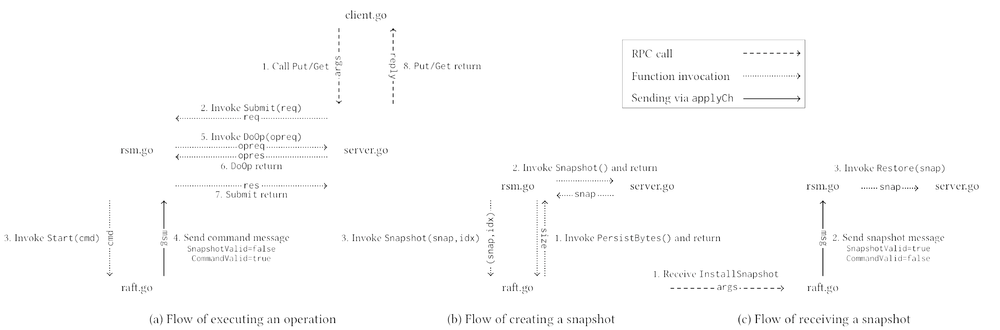

# zDB Technical Design Document

This document outlines the key technical decisions and architectural choices made in the implementation of zDB.

## Flows

### Core Components

1. **Client Interface**
   - gRPC-based API for client interactions
   - Retry mechanisms

2. **Raft Groups**
   - Independent Raft clusters per shard
   - Leader-based consensus protocol
   - Persistent state management

### Key Technical Decisions

#### RPC Framework: gRPC
- **Why gRPC?**
  - Native C++ support with high performance
  - Built-in streaming capabilities
  - Strong type safety with Protocol Buffers
  - Extensive middleware support

#### State Persistence
- **Log Storage**
  - Structured log format with checksums
  - Batched disk writes for performance
  - Memory-mapped files for fast access
  
- **Snapshotting**
  - Incremental snapshot strategy
  - Background compaction process
  - Copy-on-write for concurrent access

#### Concurrency Model
- Lock-free data structures where possible
- Fine-grained locking for state updates
- Thread pool for request processing
- Asynchronous I/O operations

### Performance Optimizations

1. **Request Batching**
   - Batch client requests for higher throughput
   - Coalesce disk writes

## Implementation Challenges

### Raft Implementation
- Careful handling of edge cases in leader election
- Proper implementation of log matching property
- Efficient log compaction mechanism

### Performance
- Balancing between consistency and performance
- Optimizing for different workload patterns
- Managing resource utilization

## Testing Strategy

1. **Unit Tests**
   - Comprehensive coverage of core logic
   - Extensive state machine testing
   - Property-based testing for protocol invariants

2. **Integration Tests**
   - Full system tests with multiple nodes
   - Network partition scenarios
   - Performance regression tests

3. **Chaos Testing**
   - Random fault injection
   - Network latency simulation
   - Load pattern variations

## Future Considerations

1. **Scalability Improvements**
   - Read Ops via leader leases

2. **Feature Extensions**
   - Transactional support
   - Pluggable storage engines

3. **Operational Improvements**
   - Enhanced monitoring
   - Automated operations
